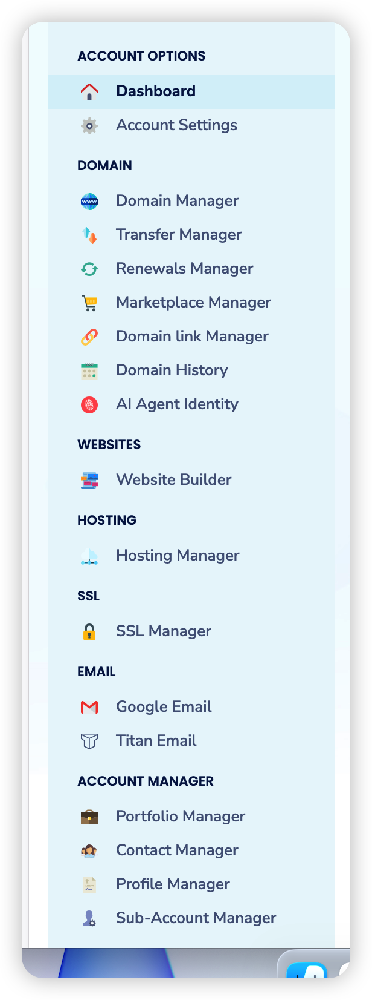
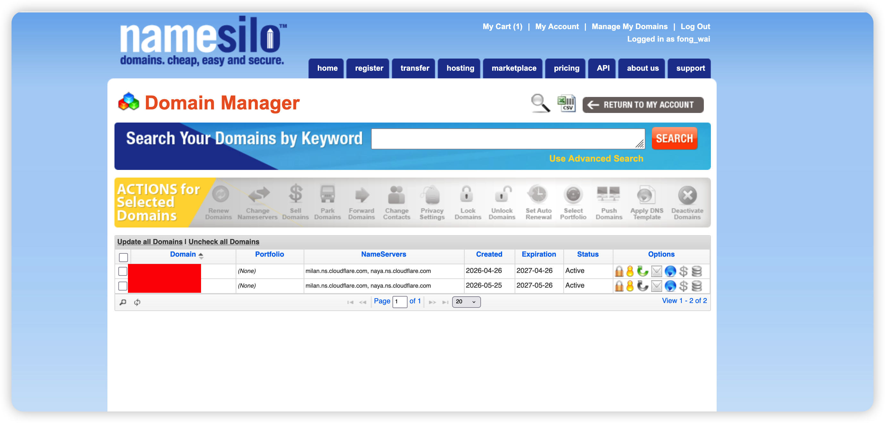
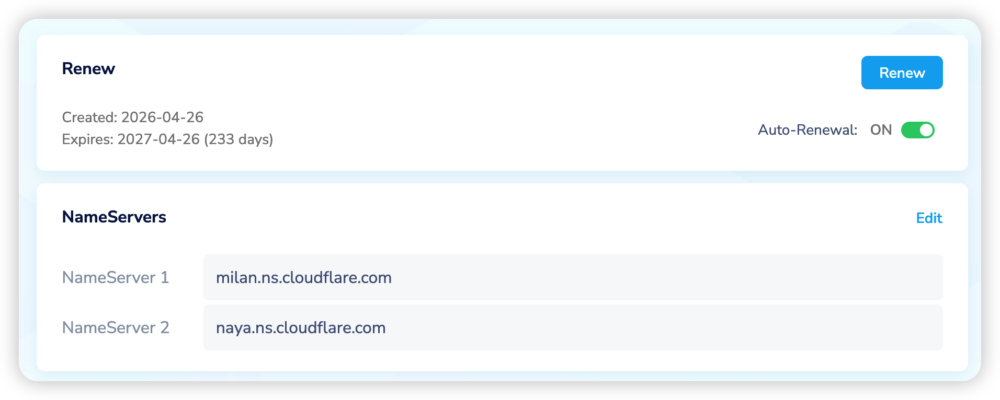

> 整体流程就三步：**买域名 → Cloudflare 托管 → Vercel 部署**。域名是门牌号，Cloudflare 管解析，Vercel 负责把博客跑起来。

---

## 一、购买域名

推荐 [Namesilo](https://www.namesilo.com/)：价格便宜，送隐私保护，支持支付宝。

买好域名后，先别急着用它——域名还需要一个"DNS 托管商"来管理解析记录。我们选择 Cloudflare：免费、稳定，还自带 CDN 和防护。

---

## 二、Cloudflare 托管域名

### 1. 注册并添加站点

去 [Cloudflare](https://dash.cloudflare.com/sign-up) 用邮箱注册一个免费账号，登录后点击 **Add a domain**，输入你刚买的主域名（不带 `www`，例如 `example.com`）。

一路保持默认：DNS 记录让它自动扫描，套餐选 **Free** 就够用。

### 2. 记下 Cloudflare 的名称服务器

添加完成后，Cloudflare 会分配给你两个名称服务器（Nameservers），类似：

```
milan.ns.cloudflare.com
naya.ns.cloudflare.com
```

每个人分到的地址不同，以你自己的为准。记下来，下一步要用。

### 3. 回 Namesilo 修改名称服务器

登录 Namesilo，点击右上角账户菜单，选择 **Domain Manager**：



进入后就能看到自己购买的域名列表：



点击域名进入详情页，找到 **NameServers** 区域，点击 **Edit**，把默认的名称服务器替换成第 2 步 Cloudflare 给的那两个地址，保存：



### 4. 等待生效

修改后需要等全球 DNS 同步，一般几分钟到几小时。Cloudflare 控制台里域名状态从 **Pending** 变成 **Active**，就说明托管成功了。

---

## 三、Vercel 部署

### 1. 导入仓库

博客代码先推到 GitHub，然后去 [Vercel](https://vercel.com/) 用 GitHub 账号登录，点击 **Add New → Project**，选择你的博客仓库导入。

### 2. 部署

Vercel 会自动识别框架（Astro、Hexo、Hugo 等都能认出来），一般保持默认配置，直接点 **Deploy**。

几十秒后就能拿到一个 `xxx.vercel.app` 的免费域名，博客已经上线了。

### 3. 绑定自己的域名

进入项目的 **Settings → Domains**，输入你在 Namesilo 买的域名并添加。

按 Vercel 的提示，回 Cloudflare 的 DNS 设置里加一条 CNAME 记录，指向 Vercel 给的目标地址即可。等证书签发完成，你的域名就能访问博客了。

> 注意：如果域名托管在 Cloudflare，绑定 Vercel 时建议把该记录的"小橙云"代理暂时关掉（仅 DNS），等证书签发后再开，避免证书验证失败。
